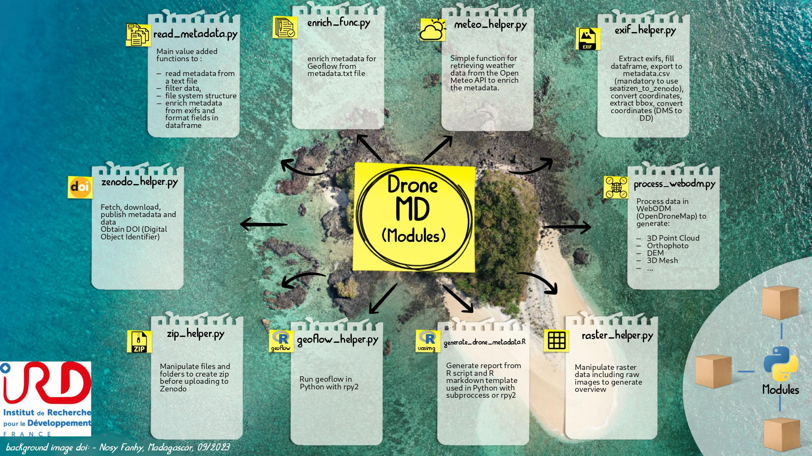

DroneMD (Metadata)'s documentation!
==============================================
DroneMD makes it easy to create metadata and enrich data by creating added value such as specific files in GIS format or reports including flight parameters and indicators including thumbnails to visualise data effectively.

Part of the package can be used in the field to check the validity of the data acquired and avoid a wasted day or an inconvenient return trip to the field.

The metadata and configuration files generated follow the format used in geoflow : 

.. image:: https://zenodo.org/badge/DOI/10.5281/zenodo.4275926.svg
  :target: https://doi.org/10.5281/zenodo.4275926
  :alt: r-geoflow by Emmanuel Blondel

Source on GitHub at `IRDG2OI/DroneMD <https://github.com/IRDG2OI/DroneMD>`_

This project is being developed as part of the G2OI project, cofinanced by the European union, the Reunion region, and the French Republic.

Project made for G2OI [#f1]_ project by IRD [#f2]_

.. rubric:: Notes

.. [#f1] https://www.ird.fr/projet-g2oi-grand-observatoire-de-locean-indien
.. [#f2] https://ird.fr
